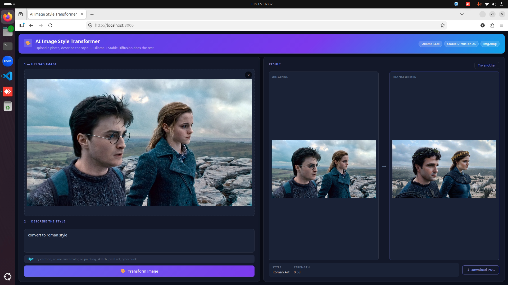

# AI Image Style Transformer

Transform any photo into a different artistic style using a local LLM and Stable Diffusion XL — fully offline, no cloud API required.

  



## How It Works

1. Upload a photo and describe the style you want (e.g. "make it look like an anime")
2. **Ollama** parses your request and generates an optimized Stable Diffusion prompt
3. **Stable Diffusion XL img2img** transforms the image while preserving the original composition
4. Download the result

## Features

- Natural language style requests — no prompt engineering needed
- Preserves original image structure, faces, and composition
- Fully local — no cloud APIs or subscriptions required
- Supports any artistic style: cartoon, anime, oil painting, watercolor, sketch, cyberpunk, and more

## Requirements

- Python 3.10+
- [Ollama](https://ollama.com) installed and running
- NVIDIA GPU with 8GB+ VRAM recommended (CPU fallback available)

## Setup

**1. Clone the repository**
```bash
git clone https://github.com/rendraep/image-restyler.git
cd image-restyler
```

**2. Install Ollama and pull a model**
```bash
ollama pull qwen3.5:9b
```

**3. Install Python dependencies**
```bash
cd backend
pip install -r requirements.txt
```

For GPU acceleration (recommended), install PyTorch with CUDA first:
```bash
pip install torch torchvision --index-url https://download.pytorch.org/whl/cu124
```

**4. Configure environment**
```bash
cp .env.example .env
```

Edit `.env` as needed. The defaults work out of the box if you have Ollama running and a CUDA GPU available.

**5. Run the server**
```bash
python main.py
```

Open `http://localhost:8000` in your browser. The Stable Diffusion model (~7GB) will be downloaded from HuggingFace automatically on the first request.

## Configuration

| Variable | Default | Description |
|---|---|---|
| `USE_LOCAL_SD` | `true` | Enable local Stable Diffusion |
| `SD_MODEL` | `Lykon/dreamshaper-xl-1-0` | HuggingFace model ID |
| `OLLAMA_MODEL` | `qwen3.5:9b` | Ollama model to use |
| `OLLAMA_BASE_URL` | `http://localhost:11434` | Ollama server URL |
| `PYTORCH_CUDA_ALLOC_CONF` | `expandable_segments:True` | Reduces GPU memory fragmentation |

## Tech Stack

| Component | Technology |
|---|---|
| Backend | FastAPI + Python |
| LLM | Ollama (qwen3.5:9b) |
| Image generation | Stable Diffusion XL via HuggingFace Diffusers |
| Default SD model | [Lykon/DreamShaper XL](https://huggingface.co/Lykon/dreamshaper-xl-1-0) |
| Frontend | Vanilla HTML / CSS / JS |
